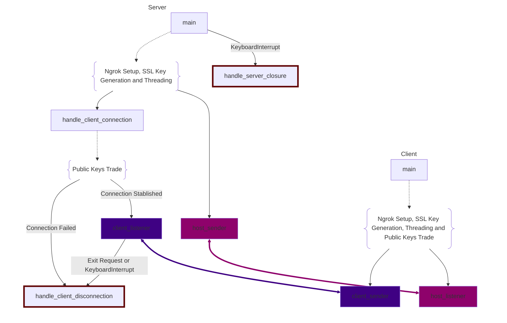

# Connection Workflow Diagram

```mermaid

flowchart TD

  subgraph server["Server"]
  %% SERVER %%
    %% Layers %%
      %% - First Layer
        A[main]
        ABCD@{ shape: braces, label: "Ngrok Setup, SSL Key Generation and Threading" }

      %% - Second Layer
        B[handle_client_connection]
        C[host_sender]
        D[handle_server_closure]
        DEF@{ shape: braces, label: "Public Keys Trade" }

      %% - Third Layer
        E[client_listener]

      %% - Fourth Layer
        F[handle_client_disconnection]

    %% Workflow

      A-.->ABCD;
      ABCD --> B
      ABCD --> C
      A --> |KeyboardInterrupt|D
        
      B -.-> DEF;
      DEF --> |Connection Stablished|E[client_listener]
      DEF --> |Connection Failed|F[handle_client_disconnection]
      E --> |Exit Request or KeyboardInterrupt|F[handle_client_disconnection]

  end

  subgraph client["Client"]
  %% CLIENT
    %% Layers %%

      %% - First Layer
        G[main]
        GHI@{ shape: braces, label: "Ngrok Setup, SSL Key Generation, Threading and Public Keys Trade" }

      %% - Second Layer
        H[client_sender]
        I[host_listener]

    %% Workflow

      G -.-> GHI
      GHI --> H
      GHI --> I

      C <==> I
      E <==> H

  end

   %% Styles %%
    
    class server server
    class client client
    class D,F error
    class E,H clients
    class C,I hosts
    linkStyle 12 stroke:#3F0183
    linkStyle 11 stroke:#8E026B

    classDef error stroke:#600304,stroke-width:4px
    classDef clients fill:#3F0183
    classDef hosts fill:#8E026B
    classDef server stroke:none,stroke-width:2px,fill:none
    classDef client stroke:none,stroke-width:2px,fill:none

```

